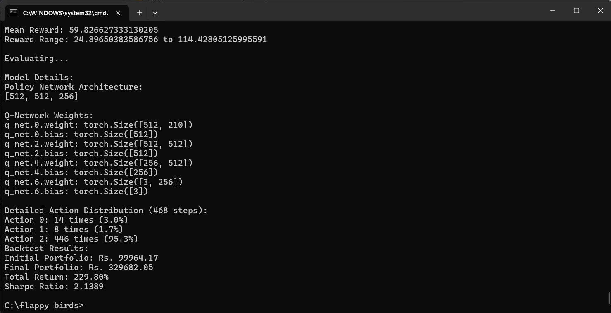
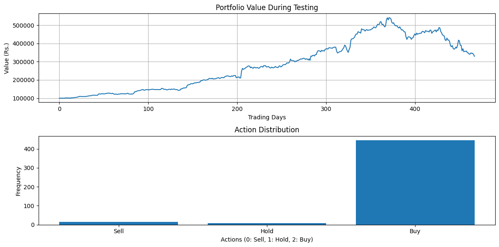
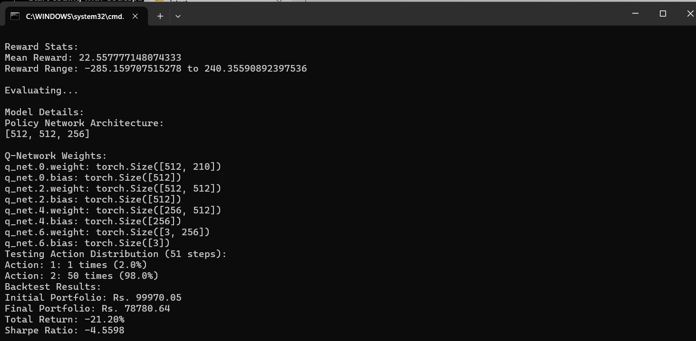
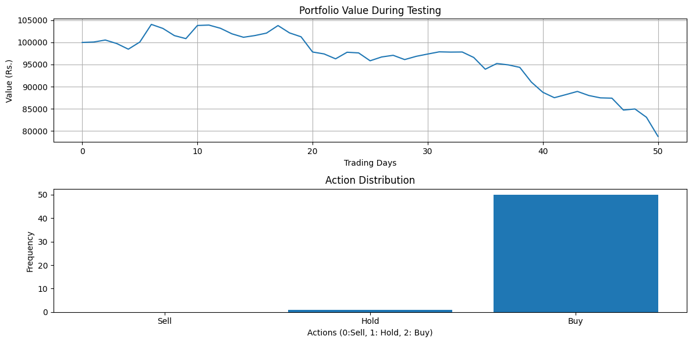
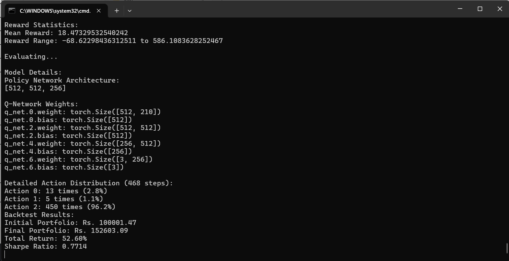
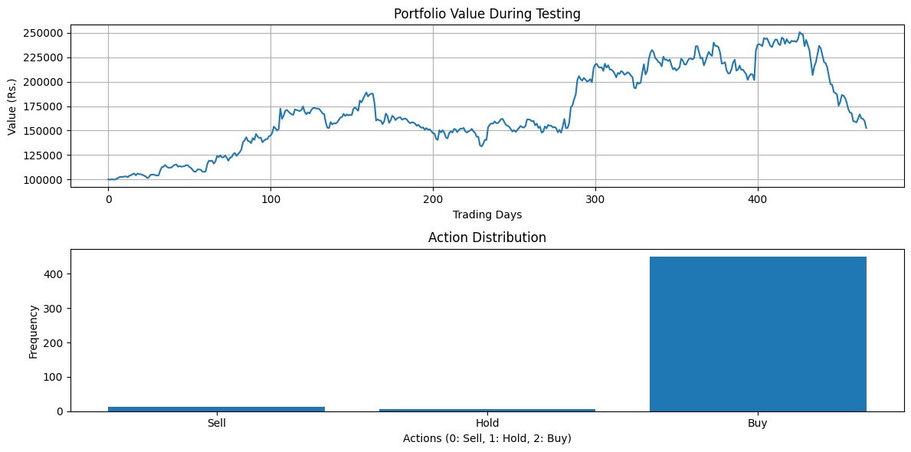

# Reinforcement Learning based Stock Trading Agent

This is a repository of a single stock trading agent using simple features from Yahoo! Finance.
The features included in this version are Open, High, Low, Volume, 5 day Moving Average, 20 day Moving Average, and Trend.

The reward function used to train the agent is Differential Sharpe Ratio.

## Trent Limited (TRENT.NS)
Performance on TRENT.NS

## Archean Chemical Industries (ACI.NS)
Performance on ACI.NS. Not the best, the agent reaches the termination condition because of the losses and stops.

## Praj Industries (PRAJIND.NS)
Performance on PRAJIND.NS

